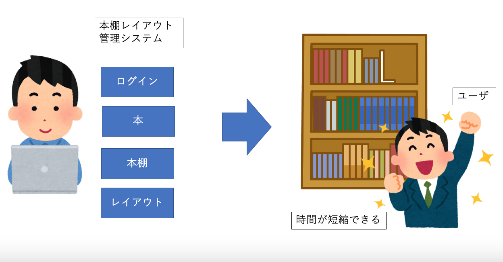

# 要求定義書

## システムの目的

本システムの目的は、本が増えるにつれて複雑になる本棚のレイアウトをユーザの好みに合わせて自動的に提案することで作業時間の短縮を図ることである。

本が増えた結果、現状の本棚のレイアウトを変更する必要があるとき、
これまでは、本棚のサイズや本の数などに応じて、本棚のレイアウトをその時々に考え直していた。

そこで、本棚レイアウトの管理を行うシステムをWebアプリケーションとして実装することで、システムが本棚のレイアウトを自動で提案する。これにより新刊購入する際に必要な作業が、システムの提案のもと実際に並び替えることのみとなり、時間の短縮が達成される。

## システムの概要

本システムは、本棚のレイアウト管理作業を、Webアプリケーションとして構築する。

下図(a)は、システム導入前の現状である。本棚のレイアウトを自ら考える形になっている。ユーザは時間をかけてレイアウトを考えていた。

下図(b)は、システム導入後のあるべき姿である。本棚レイアウト管理システムは、ユーザ、本棚、本のデータをシステム内で管理するWebアプリケーションとして実装される。ユーザは、自身のPCやスマホでWebブラウザを開き、システムにログインして、本棚のレイアウト管理を自分自身で行う。システムは、本及び本棚の管理機能、レイアウトを自動的に決定するレイアウト決定機能を持つ。

システムの導入によって、ユーザは悩むことなく自動的に本のレイアウトを決めることができる。また、考える時間を節約することができる。

## 機能一覧

- (1)ユーザ管理機能
  - システム管理者がシステムのユーザを登録・管理する機能.
    - 管理するユーザの情報は,ユーザID, パスワード, 氏名, 電話番号, メールアドレスである.

- (2)本の管理システム
  - ユーザが本の情報を登録・更新・削除する機能.
    - 本の情報は, タイトル, 巻数, 掲載雑誌, 優先度, ジャンル, 著者, 完結済みかどうかのフラグ, 本のサイズ　である.

- (3)ログイン機能
  - ユーザがシステムを利用する際のログインを行う機能.ログインはユーザIDとパスワードで行う.
    - ログインが成功すると, 本の管理システム, 本棚の管理システム, レイアウト決定機能, レイアウト保存機能を使用できるようになる.

- (4)本棚の管理機能
  - ユーザが本棚の情報を登録・更新・削除する機能.
    - 本棚の情報は本棚の個数, 各本棚の段数と各段のサイズである.

- (5)レイアウト決定機能
  - ユーザがレイアウトしたい本棚及び本を指定し，レイアウトを自動で画面に出力する機能.

- (6)レイアウト保存機能
  - 自動生成したレイアウトの情報を保存してくれる機能.
