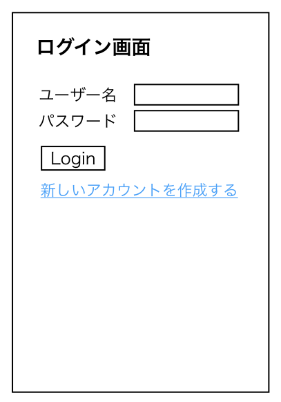

# ユースケース 1： アカウントを追加する

## 概要
システムを使用するユーザーがシステムにアカウントを追加する。

## アクター
- ユーザー

## 事前条件
- 同じIDのアカウントが既に作成されていない。

## 事後条件
- システム内にアカウントが登録される。
- ログイン画面に遷移する。

## トリガ―
- ログイン画面から「新しいアカウントを作成する」ボタンを押下する。

## 基本フロー
1. システムはアカウント追加画面を表示する。
2. ユーザーはユーザーID, パスワードを入力して、「登録」ボタンを押す。
3. システムは入力された情報をもとにアカウントを登録する。
4. システムはログイン画面を表示する。

## 代替フロー
### 代替フロー1
- 2.a.1  入力すべき情報で空欄があって，ボタンを押した場合に同じ画面を再度表示する。
### 代替フロー2
- 3.a.1  入力されたユーザーIDが既に登録されたものである場合，アカウントを登録せずにログイン画面に遷移する。
## GUI紙芝居
### ログイン画面

「新しいアカウントを作成する」ボタンを押すとアカウント作成画面に遷移する。(トリガー)

### アカウント作成画面

登録ボタンを押すことで、アカウントを作成して，ログイン画面に遷移する。