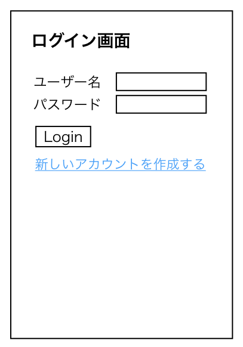
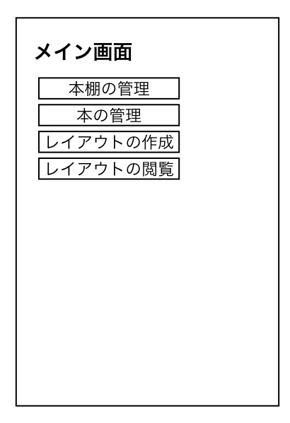

# ユースケース 2： ログインする

## 概要

システムを使用するユーザーがシステムにログインする

## アクター

- ユーザー

## 事前条件

- ユーザーがシステムにログインしてないこと。

## 事後条件

- ユーザーがシステムにログインした状態になる。
- メイン画面を表示する。

## トリガ―

- ユーザーがシステムの使用を開始する

## 基本フロー

1. システムはログイン画面を表示する。
2. ユーザーはユーザー ID を入力して、「Login」ボタンを押す。
3. システムは入力された情報をユーザー情報と照合して、合致したらログインする。
4. システムはメイン画面を表示する。

## 代替フロー

### 代替フロー 1

- 2.a.1 入力すべき情報に空欄があって，ボタンを押した場合に同じ画面を再度表示する。

### 代替フロー 2

- 3.a.1 入力された情報が既に登録された情報と合致しない場合，ログイン画面を再度表示する。

## GUI 紙芝居

### ログイン画面

正しい情報を入力して「Login」ボタンを押すことでメイン画面に遷移する。(基本フロー 3, 4)

### メイン画面

