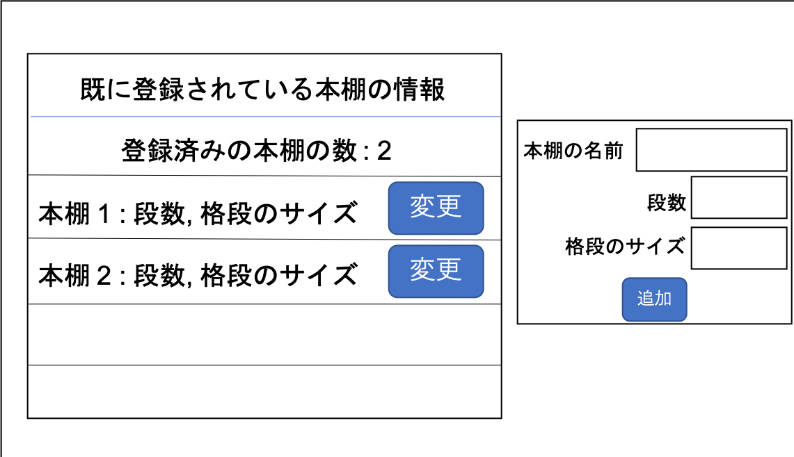
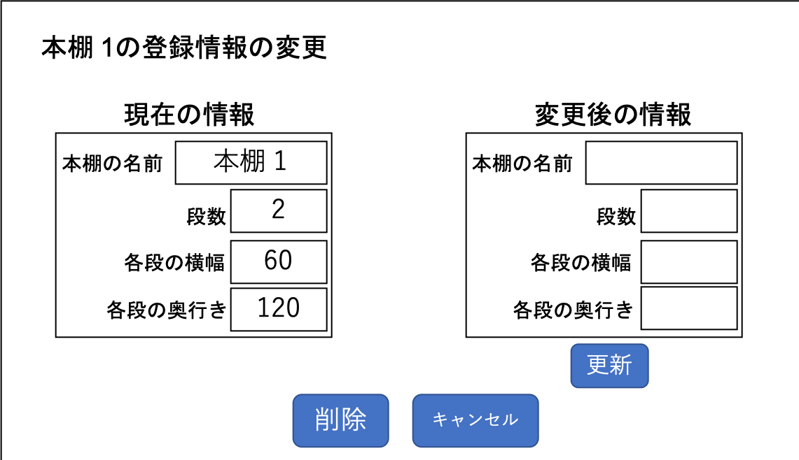

# ユースケース 4： 本棚を管理する

## 概要

ユーザーがレイアウトを管理した本棚を管理する

## アクター

- ユーザー

## 事前条件

- ユーザーがシステムにログインしている

## 事後条件

- 本棚の情報が更新される

## トリガ―

- ユーザーがメニューから「本棚の管理」を選択

## 基本フロー

A 本棚の追加

1. ユーザーはメニューから「本棚の管理」のボタンを押す
2. システムは本棚の管理用のページを表示する
3. ユーザーは新規に追加する本棚の情報をページ上の登録フォームに入力する
4. 全ての入力が完了したら「追加」ボタンを押す
5. システムは情報を更新する
6. システムは更新された情報を本棚の管理ページに反映する

B 本棚の情報の変更

1. ユーザーはメニューから「本棚の管理」のボタンを押す
2. システムは本棚の管理用のページを表示する
3. ユーザーは情報を更新したい本棚を選択し「変更」ボタンを押す
4. システムは登録情報の変更を行うページを表示する
5. ユーザーは変更後の情報をフォームに入力する
6. ユーザーは入力が完了したら「更新」ボタンを押す
7. システムは情報を更新する
8. システムは更新された情報を反映した管理ページを表示

C 本棚の情報の削除

1. ユーザーはメニューから「本棚の管理」のボタンを押す
2. システムは本棚の管理用のページを表示する
3. ユーザーは削除したい本棚を選択し「変更」ボタンを押す
4. システムは登録情報の変更を行うページを表示する
5. ユーザーは削除ボタンを押す
6. システムは情報を更新する
7. システムは更新された情報を反映した管理ページを表示する

## 代替フロー

### 代替フロー1

- A.a.1  基本フローA.4において，全てのフォームに入力ができていない場合，システムがエラー文をページ上に表示する
- A.a.2  ユーザーはエラー文を元に足りていない情報を追記
- A.a.3  基本フローのA.4に戻る

### 代替フロー2

- B.a.1  基本フローB.6において，変更後の情報が全て入力されていない場合，システムがエラー文をページ上に表示する
- B.a.2  ユーザーはエラー文を元に足りていない情報を追記
- B.a.3  基本フローのB.6に戻る

## GUI紙芝居

### 本棚の管理画面

### 本棚の情報の変更画面

