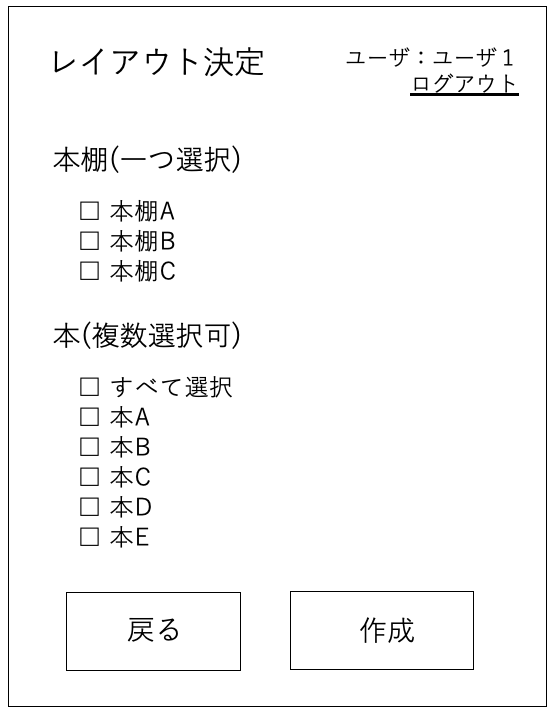
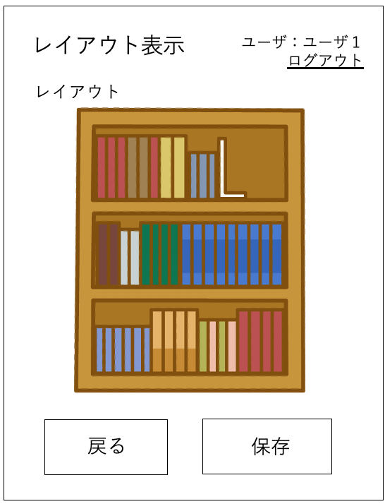

# ユースケース 5： レイアウトを決定する.

## 概要
ユーザが新たにレイアウトを決定する．

## アクター
- ユーザ

## 事前条件
- ユーザがメイン画面を表示している．

## 事後条件
- 本棚の新たなレイアウトが作成される．

## トリガ―
- ユーザが，メイン画面で「レイアウトを決定」ボタンを押す．

## 基本フロー
1. ユーザが，メイン画面で，「レイアウトを決定」ボタンを押す．
2. システムは，レイアウト決定画面を表示する．
3. ユーザは，レイアウト決定画面で，本棚，本を指定し，「作成」ボタンを押す．
4. システムは，本棚及び本の情報からレイアウトを作成し，レイアウトを表示する．
5. ユーザは，表示されたレイアウトを確認し，保存するなら「保存」ボタンを押す．
6. システムは，ユーザに指定された処理を行い，メイン画面に戻る．

## 代替フロー
### 代替フロー1
- 3a.1  基本フロー3において，ユーザが何も選択しなかった場合，エラーを表示し，2に戻る．

## GUI紙芝居
### レイアウト決定画面

### レイアウト表示画面

